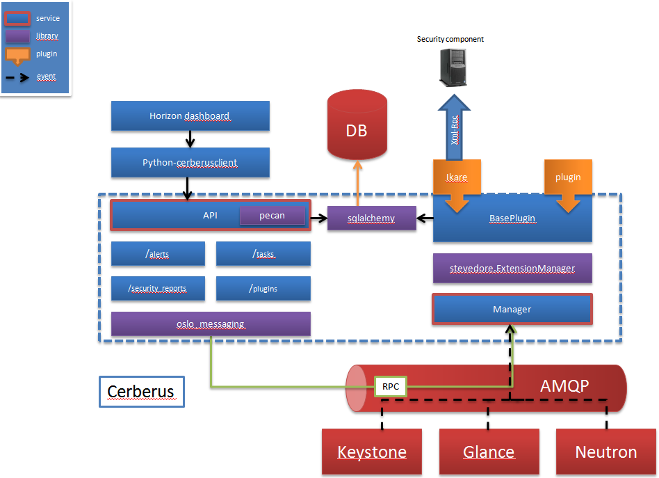

======================
Cerberus' Architecture
======================

Cerberus can be cut in two big parts:

* API
* Manager

Cerberus' API
=============
The API is a REST server documented later.

Cerberus' manager
=================
Cerberus is easy to extend thanks to a plugin system.

The manager has some functions:

- it loads ``plugins``
- it manages ``tasks``
- it stores ``security reports`` and ``security alarms`` in database

Plugins
=======

Plugins are created to communicate with a particular security component.
They are defined by their:

- unique identifier (uuid)
- name
- version
- provider
- type (scanner, SIEM...)

Plugins can subscribe to events sent on the notification topic Cerberus'
manager listens on. For example, this can be useful to automatically configure
a tool if a project has been created or if a certain role is granted to an user.
Plugins may also implement some functions that the manager calls through
``tasks``.

Tasks
=====
Cerberus manages tasks.
In order to create a task, you need to call the Cerberus' API by passing some
information:

- The name of the task
- The plugin uuid handling the task
- The method to call on this plugin
- The type (periodic or not, default is not)
- The period if the task is periodic (for now, period is in seconds only)
- Persistent (True/False, conditional): tell Cerberus you want this task to be
stored in database (useful if the manager handling the task is shut down)

The tasks may be stopped/started. As such, they have a state (running or not).

Security reports
================
Cerberus stores security reports provided by the security components.
These security reports have a predefined schema and Cerberus stores the
following information:

- The uuid of the security report
- The uuid of the plugin
- The report identifier
- The Openstack's component identifier (e.g: an instance id, a network id)
- The component type (e.g: instance, network)
- The component name
- The Openstack's project identifier
- The ticket identifier (see `sticks`_)
- The title
- The description
- The security rating
- The vulnerabilities
- The number of vulnerabilities
- The date of the last report

Security reports may be retrieved by their uuid.

.. _sticks: http://sticks-project.readthedocs.org/en/latest/index.html

Security alarms
===============
Cerberus stores security alarms provided by the security components such as
SIEM.
These security alarms have a predefined schema and Cerberus stores the
following information:

- The uuid of the alarm
- The uuid of the plugin
- The alarm identifier
- The Openstack's component identifier (e.g: an instance id, a network id)
- The Openstack's project identifier
- The ticket identifier (see `sticks`_)
- The timestamp (date when the notification has been received on oslo bus)
- The summary
- The severity
- The status (e.G: new)
- The description

Security alarms may be retrieved by their uuid.

Module loading and extensions
=============================

Cerberus manager makes use of stevedore to load extensions dynamically.